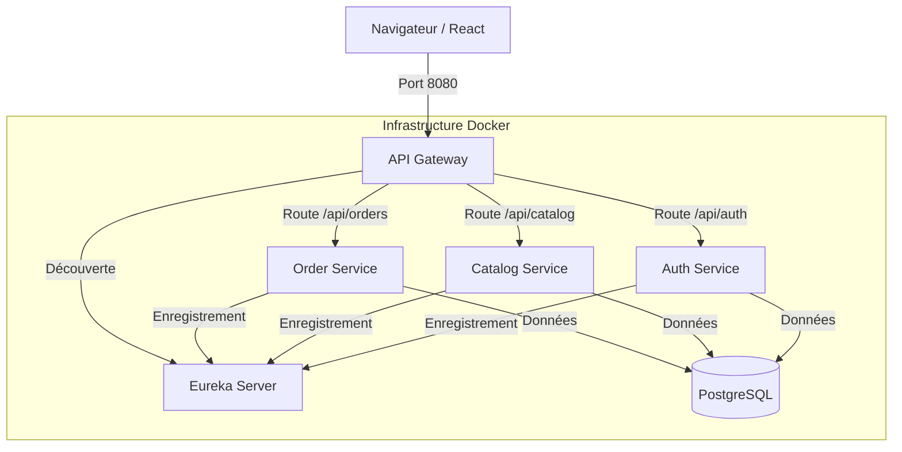

# 🏗️ Architecture Technique AzyMarket

Voici l'analyse détaillée de l'architecture actuelle de votre projet. C'est une architecture **Microservices** robuste basée sur l'écosystème Spring Cloud.

## 🗺️ Carte du Système

## 🧩 Composants Clés

### 1. Frontend (`ecommerce-frontend`)
*   **Techno :** React + Vite + TailwindCSS.
*   **Rôle :** Interface utilisateur.
*   **Communication :** Ne parle JAMAIS directement aux microservices. Il ne parle qu'à l'**API Gateway**.

### 2. API Gateway (`api-gateway`)
*   **Techno :** Spring Cloud Gateway.
*   **Port :** `8080`.
*   **Rôle :**
    *   Point d'entrée unique.
    *   **Routage :** Dirige `/api/auth` vers Auth-Service, `/api/catalog` vers Catalog-Service.
    *   **CORS Global :** Gère les autorisations de sécurité pour le navigateur.

### 3. Auth Service (`auth-service`)
*   **Techno :** Spring Security + JWT.
*   **Rôle :**
    *   Inscription / Connexion.
    *   Génération des tokens JWT.
    *   Oauth2 (Google).
*   **Particularité :** Configuré en "Racine Propre" (écoute sur `/`), le Gateway se charge de retirer le préfixe `/api/auth`.

### 4. Catalog Service (`catalog-service`)
*   **Techno :** Spring Data JPA.
*   **Rôle :**
    *   Gestion des Produits et Catégories.
    *   **Data Seeder :** Remplit automatiquement la base avec des produits de démo au démarrage.
    *   **Gestion d'Erreur :** Capture les doublons pour éviter les crashs 500.

### 5. Order Service (`order-service`)
*   **Techno :** Spring Boot.
*   **Rôle :** Gestion des commandes et paniers (en cours de développement).

### 6. Infrastructure
*   **PostgreSQL :** Base de données unique (pour l'instant) partagée entre les services via des schémas ou tables distincts.
*   **Eureka (Discovery) :** Annuaire dynamique. Permet au Gateway de trouver les services même si leurs adresses IP changent (ex: redémarrage Docker).

## 🔄 Flux de Données

1.  **Démarrage :**
    *   Tous les services se lancent et disent à Eureka : "Je suis là !".
    *   `api-gateway` demande à Eureka : "Qui est disponible ?".
    *   `catalog-service` vérifie la DB. Vide ? -> Il injecte les produits de test.

2.  **Utilisation :**
    *   Le client demande `/api/catalog/products`.
    *   Gateway reçoit -> Transfère à `catalog-service`.
    *   `catalog-service` interroge Postgres -> Renvoie JSON.
    *   Gateway renvoie la réponse au Client.

## 🛡️ Sécurité
*   **JWT (JSON Web Token) :** Utilisé pour sécuriser les échanges.
*   **Auth Service** signe le token.
*   **Gateway** (ou les services individuels) vérifie le token pour autoriser l'accès aux routes protégées (ex: `/admin/**`).

C'est une architecture solide, scalable et moderne, prête pour le monde réel ! 🚀
