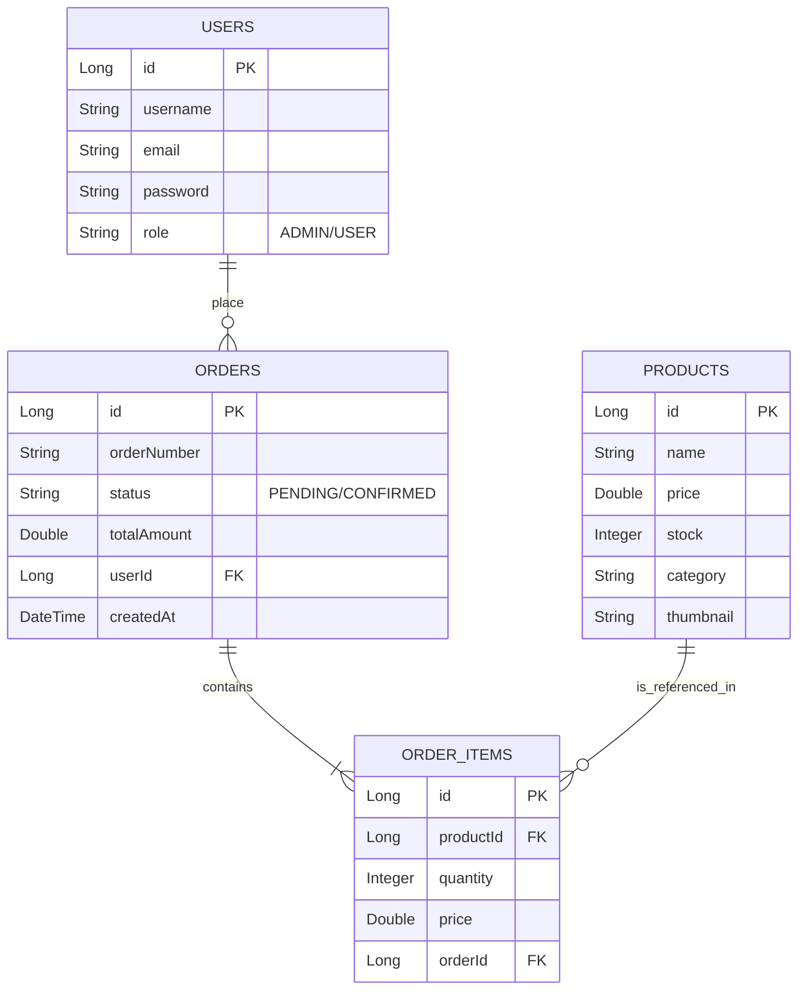
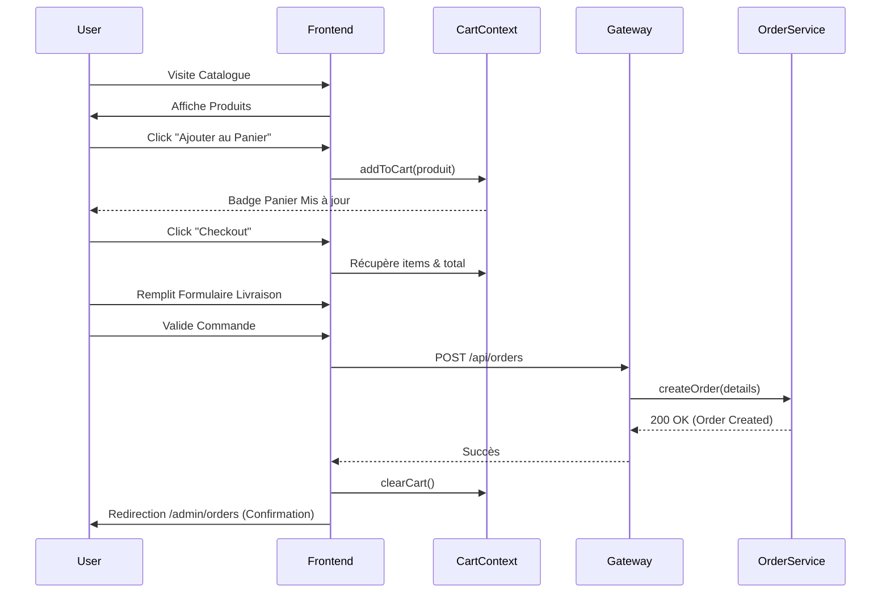

# 📊 Analyse du Projet & Plan de Développement - AzyMarket

**Date :** 14 Février 2026
**Version :** 1.0
**Statut :** Phase 2 Terminée (MVP Fonctionnel)

---

## 1. 🏗️ Architecture du Système

Le projet repose sur une architecture **Microservices** robuste avec Spring Boot et React.

```mermaid
graph TD
    subgraph Client
        Browser[Navigateur Client/Admin]
        React[Frontend React (Port 5173)]
    end

    subgraph Infrastructure
        Gateway[API Gateway (Port 8080)]
        Eureka[Discovery Service (Port 8761)]
    end

    subgraph Microservices
        Auth[Auth Service (Port 8081)]
        Catalog[Catalog Service (Port 8082)]
        Order[Order Service (Port 8083)]
    end

    subgraph Databases
        DB_User[(DB Users)]
        DB_Product[(DB Catalogue)]
        DB_Order[(DB Commandes)]
    end

    Browser --> React
    React -- API REST --> Gateway
    Gateway -- Route --> Auth
    Gateway -- Route --> Catalog
    Gateway -- Route --> Order
    
    Auth --> DB_User
    Catalog --> DB_Product
    Order --> DB_Order
    
    Auth -.-> Eureka
    Catalog -.-> Eureka
    Order -.-> Eureka
    Gateway -.-> Eureka
```

### Points Forts de l'Architecture
*   **Scalabilité** : Chaque service peut être redémarré ou mis à l'échelle indépendamment.
*   **Sécurité** : Point d'entrée unique via la Gateway qui gère le CORS et le routage.
*   **Indépendance** : Le Frontend est totalement découplé du Backend.

---

## 2. 🗃️ Modèle de Données (Schéma ER)

Voici comment les données sont structurées et liées entre les différents services.



---

## 3. 🛒 Flux Utilisateur (User Flow)

Le parcours d'achat complet implémenté actuellement :



---

## 4. 🗺️ Plan d'Action & Collaboration

Pour travailler efficacement avec votre collègue, voici la répartition recommandée des tâches futures.

### 🟢 Phase 3 (À faire maintenant) : Consolidation

| Tâche | Assigné à | Priorité | Description |
| :--- | :--- | :--- | :--- |
| **Gestion de Stock** | Collègue | Haute | Décrémenter le stock `catalog-service` quand une commande est passée. |
| **Mes Commandes (Client)** | Vous | Moyenne | Créer la page `/account/orders` pour que le client voie son historique. |
| **Paiement (Mock)** | Collègue | Moyenne | Intégrer une fausse page de paiement Stripe/PayPal visuelle. |
| **Images Upload** | Vous | Basse | Améliorer l'upload d'images (stockage AWS S3 ou dossier externe propre). |

### 🛠️ Organisation Git (Rappel)

Pour éviter les conflits :

```mermaid
gitGraph
    commit
    branch main
    checkout main
    commit
    branch feat/panier-client
    checkout feat/panier-client
    commit id: "Dev Panier"
    checkout main
    branch feat/stock-backend
    checkout feat/stock-backend
    commit id: "Dev Stock"
    checkout main
    merge feat/panier-client
    merge feat/stock-backend
```

1.  **Chacun sa branche** (`feat/nom-tache`).
2.  **Pull Request** pour valider le code de l'autre.
3.  **Jamais de push direct** sur `main`.

---

## 5. 📥 Comment récupérer ce document ?

Ce fichier est au format **Markdown**. Pour en faire un PDF pro :
1.  Ouvrez ce fichier dans VS Code.
2.  Installez l'extension **"Markdown PDF"**.
3.  Faites `Clic Droit` -> `Markdown PDF: Export (pdf)`.

Cela générera un document propre avec tous les diagrammes visibles !
