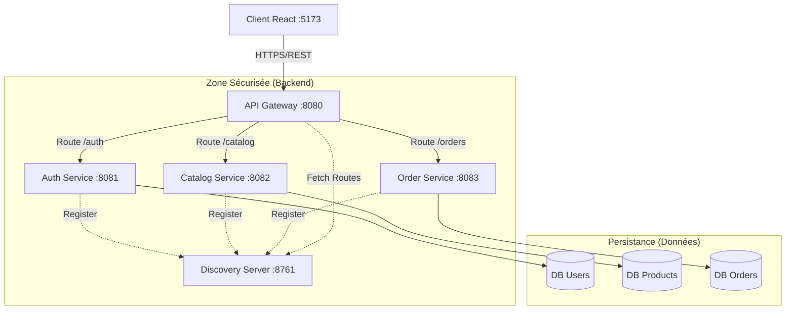
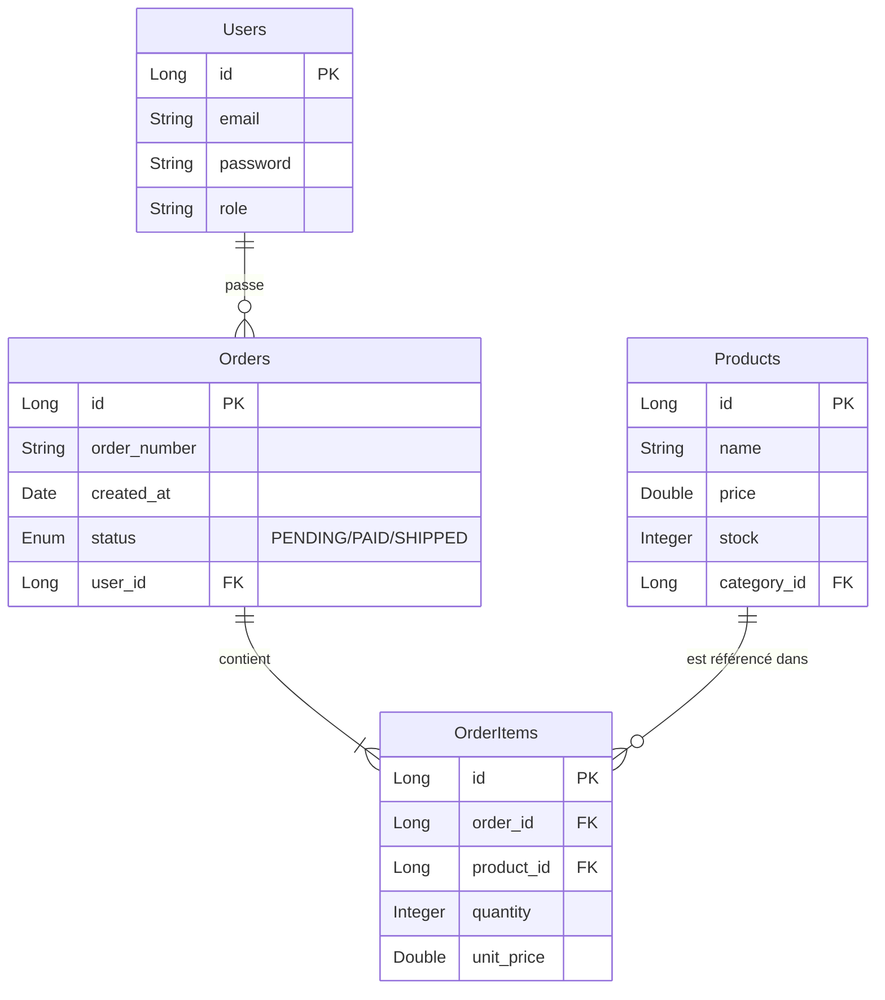
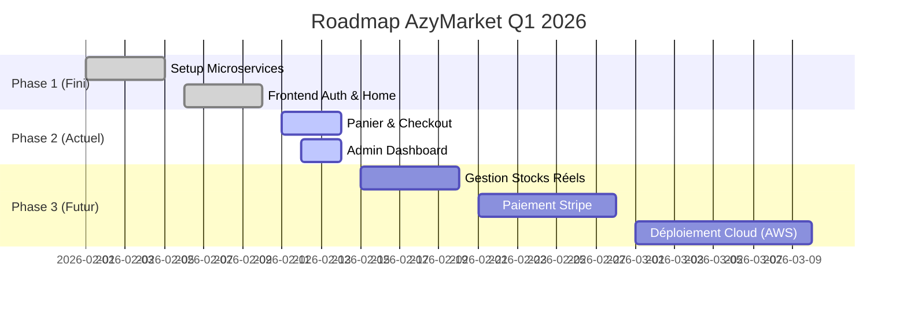

# 📘 Étude Technique & Analyse des Besoins - AzyMarket

**Date :** 14 Février 2026
**Version :** 2.0 (Post-MVP)
**Auteurs :** Équipe de Développement AzyMarket

---

## 1. 🎯 Introduction & Contexte

Le projet **AzyMarket** est une plateforme e-commerce moderne conçue pour offrir une expérience utilisateur fluide et une gestion administrative puissante. L'objectif est de fournir une solution évolutive capable de gérer un catalogue de produits, des commandes clients et un suivi administratif complet.

### Objectifs Principaux
1.  **Expérience Client Premium** : Interface réactive, Panier dynamique, Checkout simplifié.
2.  **Gestion Admin Efficace** : Dashboard centralisé pour Produits, Commandes, Clients.
3.  **Scalabilité** : Architecture Microservices pour supporter la montée en charge.
4.  **Sécurité** : Authentification JWT, Gestion des Rôles (RBAC).

---

## 2. 📋 Analyse des Besoins Fonctionnels

### A. Espace Client (Front-Office)
| Fonctionnalité | Description | Priorité |
| :--- | :--- | :--- |
| **Inscription/Connexion** | Création de compte sécurisée avec email/password. | Haute |
| **Catalogue Produits** | Affichage grille, recherche par nom, filtres par catégorie. | Haute |
| **Panier** | Ajout/Suppression, Modification quantité, Calcul total dynamique. | Haute |
| **Checkout** | Formulaire de livraison, Récapitulatif, Validation de commande. | Haute |
| **Tableau de Bord Client** | Historique des commandes, Suivi de statut. | Moyenne |

### B. Espace Administrateur (Back-Office)
| Fonctionnalité | Description | Priorité |
| :--- | :--- | :--- |
| **Dashboard Global** | Vue synthétique (KPIs) : Total ventes, Nouveaux clients. | Haute |
| **Gestion Catalogue** | CRUD Produits (Créer, Lire, Mettre à jour, Supprimer), Images. | Haute |
| **Gestion Commandes** | Liste des commandes, Changement de statut (En cours -> Livré). | Haute |
| **Analytiques** | Rapports détaillés sur les ventes et produits populaires. | Moyenne |

---

## 3. 🎭 Diagramme de Cas d'Utilisation (Use Case)

Ce diagramme illustre les interactions possibles selon le rôle de l'utilisateur.

```mermaid
usecaseDiagram
    actor "Client" as C
    actor "Administrateur" as A

    package "AzyMarket Platform" {
        usecase "S'inscrire / Se Connecter" as UC1
        usecase "Parcourir le Catalogue" as UC2
        usecase "Gérer son Panier" as UC3
        usecase "Passer une Commande" as UC4
        usecase "Voir ses Commandes" as UC5

        usecase "Gérer les Produits" as UC6
        usecase "Gérer les Commandes" as UC7
        usecase "Voir les Statistiques" as UC8
        usecase "Gérer les Utilisateurs" as UC9
    }

    C --> UC1
    C --> UC2
    C --> UC3
    C --> UC4
    C --> UC5

    A --> UC1
    A --> UC6
    A --> UC7
    A --> UC8
    A --> UC9
```

---

## 4. 🏗️ Architecture Technique (Microservices)

L'application repose sur une architecture distribuée pour garantir la robustesse.

### Composants Clés
*   **Gateway (Spring Cloud Gateway)** : Point d'entrée unique, gère le routage et la sécurité (CORS).
*   **Discovery (Eureka)** : Annuaire des services pour la scalabilité dynamique.
*   **Auth Service** : Gestion des utilisateurs et tokens JWT.
*   **Catalog Service** : Gestion des produits et stocks.
*   **Order Service** : Gestion du cycle de vie des commandes.



---

## 5. 🗃️ Modélisation des Données (ER Diagram)

Structure relationnelle optimisée pour l'intégrité des données.



---

## 6. 🔒 Besoins Non-Fonctionnels & Sécurité

### Sécurité
1.  **Authentification Statless** : Utilisation de **JWT (JSON Web Tokens)**. Le serveur ne stocke pas de session.
2.  **Protection des Données** : Mots de passe hashés avec **BCrypt**.
3.  **CORS (Cross-Origin Resource Sharing)** : Configuré strictement sur la Gateway pour n'autoriser que le Frontend officiel.

### Performance
1.  **Mise en Cache** : Le catalogue produit peut être mis en cache (Redis) pour réduire la charge DB (Evolution future).
2.  **Asynchronisme** : Les emails de confirmation (futur) seront envoyés via RabbitMQ pour ne pas bloquer l'utilisateur.

---

## 7. 🚀 Roadmap & Prochaines Étapes

Planification stratégique pour les semaines à venir.



---

### 📥 Export PDF
Pour obtenir ce rapport en format professionnel :
1. Installer l'extension **Markdown PDF** sur VS Code.
2. Clic droit dans ce fichier -> `Export (pdf)`.
